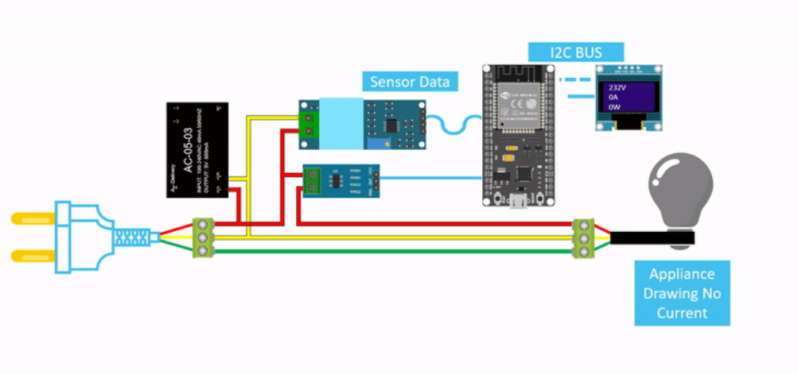

# 🔌 Smart Plug — IoT Energy Monitor & Remote Control

A Wi-Fi enabled smart plug built on the **ESP32** that monitors real-time **voltage, current, power, and energy consumption**, and allows remote **on/off control** of any connected appliance through a **Firebase-powered web dashboard**.

> 📚 Course: Measurements — Mechatronics Engineering  
> 🏫 Egypt Japan University of Science and Technology (E-JUST)

---

## 🌐 Live Web Dashboard

👉 [Open Control Panel](https://test-99027.firebaseapp.com/)

> Control the relay and monitor live power readings from any device with a browser.

---

## 📋 Overview

This project replaces a traditional smart plug with a fully custom IoT device. The ESP32 reads AC voltage and current using dedicated sensors, computes RMS values and power consumption in real time, logs everything to **Firebase Realtime Database**, and listens for remote relay commands — all over Wi-Fi.

---

## ✨ Features

- 🔴 **Remote ON/OFF control** via web dashboard (Firebase stream, near real-time response)
- ⚡ **AC Voltage measurement** using ZMPT101B sensor (RMS calculation, 250 samples)
- 🔋 **AC Current measurement** using ACS712 sensor (RMS calculation, 250 samples)
- 💡 **Power calculation** — apparent power (P = V × I) in Watts
- 📊 **Energy accumulation** — running total in Wh logged to Firebase
- 🕒 **NTP time sync** — all readings timestamped with real epoch time
- 📡 **Firebase Realtime Database** — sensor data pushed every 1 second

---

## 🏗️ System Architecture

```
          ┌─────────────────────────────────────────┐
          │            AC Mains Supply               │
          └────────────┬────────────────┬────────────┘
                       │                │
               [ZMPT101B]          [ACS712]
               Voltage Sensor   Current Sensor
                       │                │
                  GPIO34           GPIO32
                       └──────┬─────────┘
                           [ESP32]
                         GPIO2 │ Wi-Fi
                           [Relay] ───► [Appliance]
                               │
                        [Firebase RTDB]
                               │
                        [Web Dashboard]
                         (Browser / Phone)
```

### Circuit Diagram



### Circuit Reference

> Circuit diagram adapted from: [DIY Real-Time Energy Monitoring Device using ESP32](https://circuitdigest.com/microcontroller-projects/diy-real-time-energy-monitoring-device-using-esp32) — Circuit Digest  
> **Modification:** OLED display replaced with a Firebase Realtime Database web dashboard for remote monitoring and control.
---

## 🧰 Hardware Components

| Component | Model | Purpose |
|-----------|-------|---------|
| Microcontroller | ESP32 | Wi-Fi, ADC reading, relay control |
| Voltage Sensor | ZMPT101B | AC mains voltage measurement |
| Current Sensor | ACS712 (20A) | AC current measurement |
| Relay Module | 5V Active-HIGH | Switch connected appliance ON/OFF |
| Power Supply | AC-05-03 | 230V AC → 5V DC for ESP32 |
| Appliance | Any (e.g. light bulb) | Load being monitored/controlled |

---

## 📐 Pin Configuration

| ESP32 Pin | Connected To | Function |
|-----------|-------------|----------|
| GPIO34 (ADC1_CH6) | ZMPT101B OUT | AC Voltage sensing |
| GPIO32 (ADC1_CH0) | ACS712 OUT | AC Current sensing |
| GPIO2 | Relay IN | Appliance ON/OFF control |

---

## 📊 Sensor & Measurement Details

### RMS Calculation
Both voltage and current are sampled **250 times** using the ESP32's 12-bit ADC (0–4095), then RMS is computed:

```
RMS = sqrt( (1/N) * Σ(sample - offset)² ) × (VREF / ADC_MAX)
```

### Calibration Parameters
| Parameter | Value | Notes |
|-----------|-------|-------|
| ADC Reference Voltage | 3.3V | ESP32 supply |
| ADC Resolution | 4095 | 12-bit |
| ZMPT101B ADC Offset | 1868.62 | Calibrated midpoint |
| ZMPT101B Scale Ratio | 673 | Maps RMS pin voltage → AC voltage |
| ACS712 ADC Offset | 2251.74 | Calibrated zero-current point |
| ACS712 Sensitivity | 100 mV/A | For 20A module |

### Power & Energy
```
P (W)  = V_rms × I_rms
E (Wh) += P × (dt / 3600)        ← accumulated every loop iteration
```

---

## ☁️ Firebase Structure

```
/UsersData/
  └── <uid>/
        ├── sensor_readings/
        │     └── <epoch_timestamp>/
        │           ├── voltage_V
        │           ├── current_A
        │           ├── power_W
        │           ├── energy_Wh
        │           └── timestamp_epoch
        └── control/
              └── relayState       ← 0 = OFF, 1 = ON
```

The ESP32 **streams** the `relayState` path in real time — when the web dashboard toggles the switch, the relay responds within milliseconds via `Firebase.RTDB.setStreamCallback`.

---

## 💻 Software & Libraries

| Library | Purpose |
|---------|---------|
| `WiFi.h` | ESP32 Wi-Fi connection |
| `Firebase_ESP_Client` | Firebase RTDB read/write/stream |
| `time.h` | NTP time synchronization |

---

## 📁 Repository Structure

```
smart-plug-esp32/
├── README.md
├── src/
│   └── esp32_modified_v2.ino     ← Main ESP32 firmware
└── circuit/
    └── smart_plug_circuit.png    ← Circuit diagram
```

---

## ⚠️ Notes

- WiFi credentials and Firebase API keys in the source code are for the project demo instance — replace with your own before deploying.
- Sensor offsets (`ZMPT101B_ADC_OFFSET`, `ACS712_ADC_OFFSET`) must be **calibrated** for your specific hardware — values in code were tuned for this build.
- The original design included an OLED display (I2C) for local readings — this was replaced with the Firebase web dashboard.

---

## 🔮 Future Improvements

- Add **energy cost calculation** based on local electricity tariff
- Implement **overload protection** — auto-shutoff above a current threshold
- Add **OLED display** back for local readout without internet
- Schedule-based **timer control** (e.g. turn off after X hours)
- OTA (Over-the-Air) firmware updates

---

## 👤 Author

**Kareem Soliman** — Mechatronics Engineering Student, E-JUST  
[LinkedIn](https://www.linkedin.com/in/kareem-04-soliman/) · [GitHub](https://github.com/Kareem-04)
